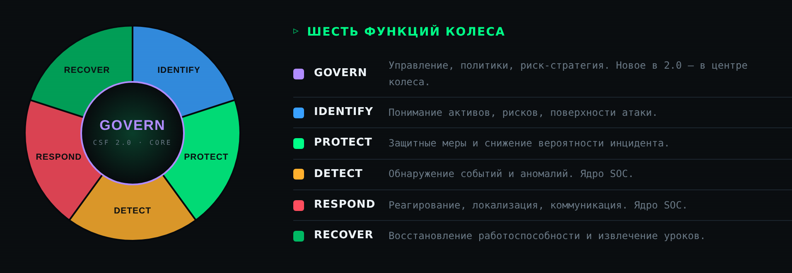
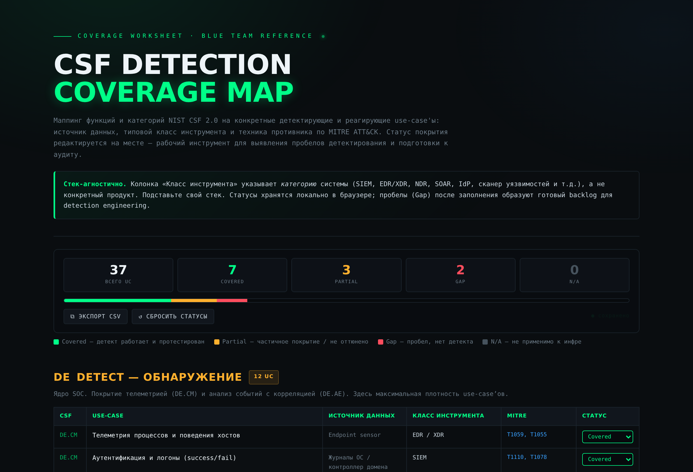

### NIST CSF 2.0 для SOC — операционный набор blue team

Референс, самооценка зрелости и карта покрытия детектирования
для практического применения NIST CSF 2.0 в Security Operations Center.

🌐 **Открыть вживую:** [zavetsec.github.io/CSFKit](https://zavetsec.github.io/CSFKit/)

> **CSFKit помогает SOC-командам применять NIST CSF 2.0 на практике:**
>
> - 📘 операционный референс по шести функциям CSF;
> - 📊 самооценка зрелости SOC (Tier 1–4);
> - 🎯 карта покрытия детектирования CSF × MITRE ATT&CK.
>
> Работает полностью офлайн, без зависимостей и серверной части.

## Для кого

SOC-аналитики, detection-инженеры, SOC-лиды, security-менеджеры, blue-team консультанты и GRC/аудит — все, кому нужно операционализировать CSF, а не просто свериться со стандартом.

---

## О чём это

В основе **NIST Cybersecurity Framework 2.0** лежит модель из шести взаимосвязанных
функций (**Govern · Identify · Protect · Detect · Respond · Recover**), на которых
описывают, чем занимается организация в части киберриска и насколько это зрело.

CSF сам по себе — не чеклист настроек, а **язык управления риском**. Этот репозиторий
переводит его на язык повседневной работы SOC: что делать по каждой функции, как
измерять зрелость и какие use-case'ы детектирования уже закрыты, а какие остаются
пробелами.

Весь набор **стек-агностичен** (классы систем — SIEM, EDR/XDR, NDR, SOAR, IdP — а не
конкретные продукты), **самодостаточен** (единый HTML-файл, ноль зависимостей и
сетевых запросов) и работает офлайн прямо в браузере.

---

## Состав

| # | Файл | Что это | Открыть |
|---|------|---------|---------|
| 01 | [`nist-csf-soc-framework.html`](nist-csf-soc-framework.html) | Операционный референс по шести функциям | [↗ открыть](https://zavetsec.github.io/CSFKit/nist-csf-soc-framework.html) |
| 02 | [`soc-maturity-self-assessment.html`](soc-maturity-self-assessment.html) | Интерактивная самооценка зрелости (Tier 1–4) | [↗ открыть](https://zavetsec.github.io/CSFKit/soc-maturity-self-assessment.html) |
| 03 | [`csf-coverage-map.html`](csf-coverage-map.html) | Карта покрытия use-case'ов CSF × MITRE | [↗ открыть](https://zavetsec.github.io/CSFKit/csf-coverage-map.html) |

> Ссылка на имя файла открывает исходник в репозитории, «↗ открыть» — рабочую версию на GitHub Pages.

Документы образуют связку: **референс** объясняет модель, **самооценка** показывает,
где вы сейчас по зрелости, а **карта покрытия** — что конкретно закрыто на уровне
детектов. Можно использовать по отдельности, но вместе они закрывают цикл
«понять → измерить → закрыть пробелы».

---

## Скриншоты

### Операционный референс — колесо шести функций

### Самооценка зрелости — живой расчёт Tier

### Карта покрытия — статусы CSF × MITRE

---

## Быстрый старт

1. Откройте набор на [GitHub Pages](https://zavetsec.github.io/CSFKit/).
2. Изучите **референс** — модель и зоны ответственности SOC.
3. Пройдите **самооценку** — зафиксируйте текущий и целевой Tier.
4. Заполните **карту покрытия** — отметьте статусы, выявите Gap'ы.
5. Разрывы зрелости + Gap'ы детектов = **backlog внедрения**.

Интернет не нужен: всё внутри HTML, никакой телеметрии, данные хранятся локально в браузере.

---

### 01 · Референс по функциям CSF

**`nist-csf-soc-framework.html`** &nbsp; [↗ открыть на Pages](https://zavetsec.github.io/CSFKit/nist-csf-soc-framework.html)

Ядро набора. Каждая из шести функций разобрана единообразно: суть и роль в цикле,
официальные категории с кодами (`GV.OC`, `DE.CM`, `RS.MI`), **зона ответственности
SOC**, пошаговый чеклист внедрения, метрики и **лестница зрелости** Tier 1–4.

Дополнительно: визуализация колеса, дорожная карта внедрения по фазам 0–4, сводный
каталог метрик и матрица разграничения SOC / IT / бизнес в логике RACI.

> Акцент: **Detect и Respond — ядро SOC**, **Govern** замыкает технику на
> риск-стратегию, а **Recover** через lessons learned питает новые детекты.

---

### 02 · Самооценка зрелости

**`soc-maturity-self-assessment.html`** &nbsp; [↗ открыть на Pages](https://zavetsec.github.io/CSFKit/soc-maturity-self-assessment.html)

Интерактивный чеклист из 31 утверждения по шести функциям. Отмечаете то, что верно
**прямо сейчас** — без «почти» и «в планах»:

- проценты, прогресс-бары и **Tier по каждой функции** считаются на лету;
- общий уровень — по принципу **«слабого звена»** (минимальный Tier среди функций),
  честнее среднего: зрелость гейтится самой слабой функцией;
- кнопка «копировать сводку» выгружает результат текстом для отчёта;
- прогресс сохраняется локально между сессиями.

**Целевой ориентир:** Tier 3 по Detect / Respond и Tier 2–3 по остальным. Разрывы до
целевого уровня — это и есть backlog внедрения.

---

### 03 · Карта покрытия детектирования

**`csf-coverage-map.html`** &nbsp; [↗ открыть на Pages](https://zavetsec.github.io/CSFKit/csf-coverage-map.html)

Воркшит-маппинг: 37 детектирующих и реагирующих use-case'ов разложены по функциям и
категориям CSF, с источником данных, классом инструмента и техникой противника по
**MITRE ATT&CK**. По каждому — редактируемый статус:

- 🟢 **Covered** — детект работает и протестирован
- 🟡 **Partial** — частичное покрытие / не оттюнено
- 🔴 **Gap** — пробел, нет детекта
- ⚪ **N/A** — не применимо к инфраструктуре

Сводный счётчик и цветная полоса покрытия обновляются на лету, есть экспорт в CSV.
**Gap-строки по Detect и Respond** после заполнения образуют приоритетный backlog
для detection engineering. Набор use-case'ов — стартовый, расширяется под свою
модель угроз и релевантные группировки.

---

## Дизайн и принципы

- **Zero dependencies** — каждый файл самодостаточен, без CDN, скриптов и сетевых вызовов.
- **Offline-first** — работает без интернета, ничего наружу не отправляет.
- **Stack-agnostic** — классы инструментов вместо продуктов; подставляйте свой стек.
- **Privacy by default** — состояние инструментов хранится в `localStorage`, не на сервере.
- Единый тёмный визуальный стиль, моноширинная типографика, печать в PDF из браузера.

---

## Лицензия

[MIT](LICENSE) — используйте, адаптируйте и распространяйте свободно, в том числе в
коммерческих и корпоративных контурах. Атрибуция приветствуется, но не обязательна.

---

---

⭐ Если набор оказался полезен — поставьте звезду репозиторию.

**ZavetSec** · инструменты для blue team · zero dependencies · offline-first

NIST CSF — фреймворк NIST; MITRE ATT&CK — торговая марка MITRE. Репозиторий не аффилирован с NIST или MITRE.

